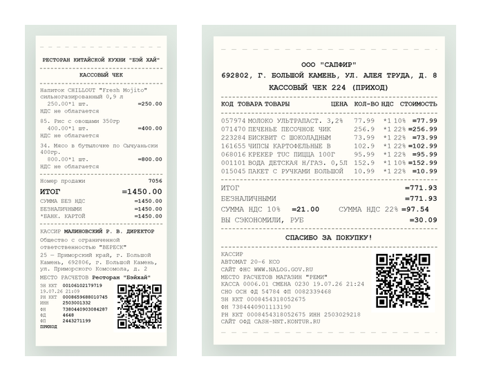

# 🧾 Receipt Studio · БЭЙ ХАЙ

A printable Russian **restaurant & supermarket receipt generator**. Build a
receipt from a menu, preview it live, print it or export it as PDF — with
formats and layouts matching real Russian receipts (58mm / 80mm).

> Built on [vinext](https://github.com/cloudflare/vinext) (Next.js 16 + Vite)
> with optional Cloudflare D1 / Drizzle support.

## 📸 Preview

<p align="center">
  
</p>

## ✨ Features

- **Two scenarios**: restaurant (58mm focused) and supermarket (80mm focused)
  templates, layouts aligned to real Russian receipts
- **Auto QR code**: generated per order, updates live with the receipt
- **WYSIWYG editing**: every field binds to the live preview
- **Two paper sizes**: 58mm and 80mm, with per-size typography
- **Print & PDF**: print stylesheet (`@media print`) outputs a clean
  receipt-only page at real paper size
- **History**: saved receipts kept locally in the browser (up to 50)
- **Bilingual**: Russian receipt content with Chinese UI

## 🧰 Tech Stack

| Layer | Tech |
| --- | --- |
| Framework | [Next.js](https://nextjs.org/) 16 (App Router, RSC) |
| UI | React 19, Tailwind CSS 4 |
| Build | [Vite](https://vite.dev/) 8 + vinext |
| Data (optional) | [Drizzle ORM](https://orm.drizzle.team/) + Cloudflare D1 |
| QR | `qrcode` |

## 🚀 Quick Start

```bash
npm install
npm run dev      # start local dev server
npm run build    # verify the build output
npm test         # build + render smoke tests
```

Requires Node.js `>=22.13.0`.

## 🧾 Usage

1. Pick a scenario (**餐厅** / **超市**) and paper size (**58mm** / **80mm**).
2. Fill in the store / order fields, or click `+` on menu items to add them.
3. Edit quantities and prices in the order list; the preview updates live.
4. Tune the QR position if needed.
5. **打印小票** prints at real paper size; save as PDF from the print dialog.

## 📁 Project Structure

```
app/                  # Next.js app (page, styles)
data/                 # menu JSON (restaurant + supermarket)
db/                   # optional Drizzle schema
tests/                # render smoke tests
drizzle.config.ts     # migration config
```

## 🔒 License

[MIT](./LICENSE) © 2026 thl1173653555-create

---

### Also available in [简体中文](./README.zh-CN.md)
